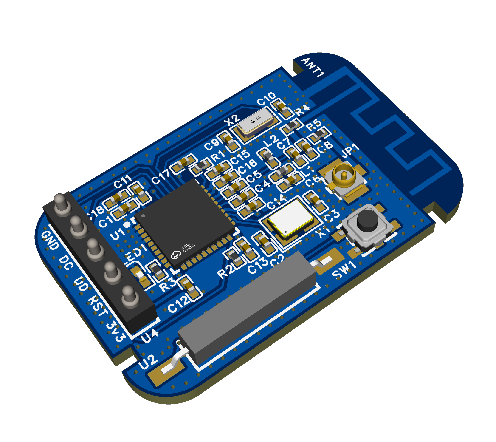

# Zigbee End Device (Contact Sensor)

This project is a **Zigbee End Device** designed to operate as a **battery-powered contact sensor** (for doors, windows, or similar applications).  
It is based on the **Texas Instruments CC2530** Zigbee SoC and can be flashed with the **PTVO firmware** to provide full Zigbee functionality.

The aim of this project is to replicate the door/window contact and try to do it as small as possible. This is my first attempt with 0402 components, easy and beautiful to design but extremely hard in the real life to solder. I've do my best! 🤣

📂 [--&gt; My OshwLab repository of the project](https://https://oshwlab.com/carletz.slug/zigbee-end-device) 
---

## 🧩 Features

- Zigbee 3.0 compatible (using [PTVO firmware](https://ptvo.info/))
- Based on **CC2530F256** microcontroller  
- Powered by a **CR2032 coin cell**
- Integrated **reed switch** for contact detection  
- **LED indicator** for status or pairing feedback  
- **Reset button** for firmware or network reset  
- Compact design suitable for enclosure integration  

---
## ⚠️ Notes
- Pogo pins on the left are only for programming.
- The X2 quartz is the one indicated on datasheet and is relative to the deep sleep calculationn of time, not used in my project because the event is triggered by the reed switch itself.
- As for the quartz I've added also the base for an external antenna but I didn't use it.
---

## 🛠️ Tools &amp; Compatibility

- Designed in **EasyEDA**
- Compatible with **Zigbee2MQTT**, **Home Assistant**, **OpenHAB**, and other automation platforms
- Zigbee module (CC2530) flashable via programmer and **TI Flash Programmer** 

## ⚙️ Firmware

The hardware is compatible with the **PTVO Zigbee firmware** generator:  
👉 [https://ptvo.info](https://ptvo.info)

You can configure the firmware as an **End Device (battery-powered)** and assign the reed contact input to the relative GPIO.

Once the configuration is ready, download the `.hex` file generated by the PTVO tool and flash it to the CC2530 chip.

---

## 🔧 Flashing Instructions

To upload the firmware to the CC2530, follow these steps:

1. **Required tools:**
   - A **CC Debugger** or compatible programmer (I've used the cheaper SmartRF04EB)
   - The **SmartRF Flash Programmer** or **TI Flash Programmer** software
   - The `.hex` file generated by PTVO

2. **Connections:**

   | CC2530 Pin | CC Debugger Pin |
   |-------------|-----------------|
   | `P2_2` (Debug Data) | `DD` |
   | `P2_1` (Debug Clock) | `DC` |
   | `GND` | `GND` |
   | `VCC` | `VCC` (3.3 V) |
   | `RESET_N` | `RESET` |

3. **Flashing procedure:**
   - Connect the programmer board to the Zigbee End Device board.
   - Verify that the programmer board LED turns green (indicating correct connection).
   - Open **SmartRF Flash Programmer**.
   - Select the connected device (**CC2530**).
   - Choose your `.hex` file.
   - Click **Program** and wait for the operation to complete.

4. **After flashing:**
   - Disconnect the programmer.
   - Power the device from the CR2032 battery.
   - The LED should blink once at startup, and the device will join the Zigbee network when powered.

---

## 💡 Credits

This project is inspired by and based on designs shared by **[DIY&amp;Zi](https://oshwlab.com/novgorod73/works)** on [OSHWHub / OSHWLab](https://oshwlab.com).  
Special thanks to **PTVO** for providing the free and flexible **Zigbee firmware generator**.

---

## 📬 Author

**carletz**  
Created: October 2025  

This project is open hardware, released under the MIT License.

